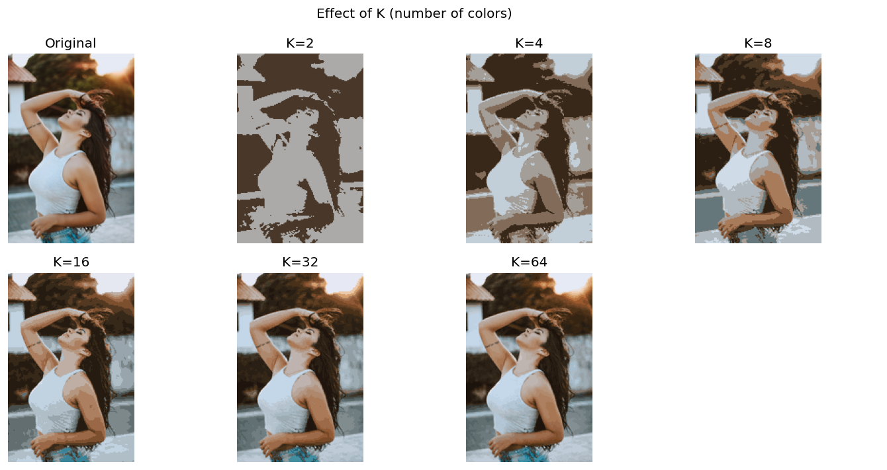

# Image Compressor (K-means)

Compress images by reducing the color palette using **K-means clustering**. Each pixel is treated as a 3D point (R, G, B). K-means finds **K** representative colors, and every pixel is replaced by its nearest cluster center.

## Setup

```bash
pip install -r requirements.txt
```

## Usage

1. Put your JPG images in an `images` folder (or set `INPUT_FOLDER` in the notebook).
2. Open `image_compressor_kmeans.ipynb` in Jupyter Lab or Jupyter Notebook.
3. Set `K` (number of colors, e.g. 8, 16, 32) and optionally `OUTPUT_FOLDER` and `MAX_DIMENSION`.
4. Run all cells.

Compressed images are saved to the output folder and shown side-by-side with the originals.

## Requirements

- Python 3.8+
- numpy, Pillow, scikit-learn, matplotlib, jupyter

## Results

### Effect of K (number of colors)

The same image compressed with different K values:



### Image 1 (original vs compressed)

| Original | Compressed (K=8) |
|----------|------------------|
|  |  |

### Image 2 (original vs compressed)

| Original | Compressed (K=8) |
|----------|------------------|
|  |  |
